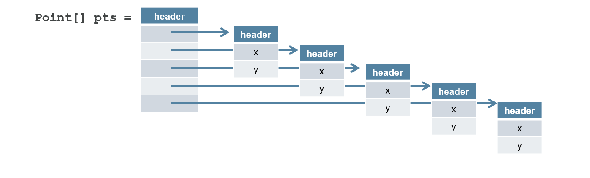
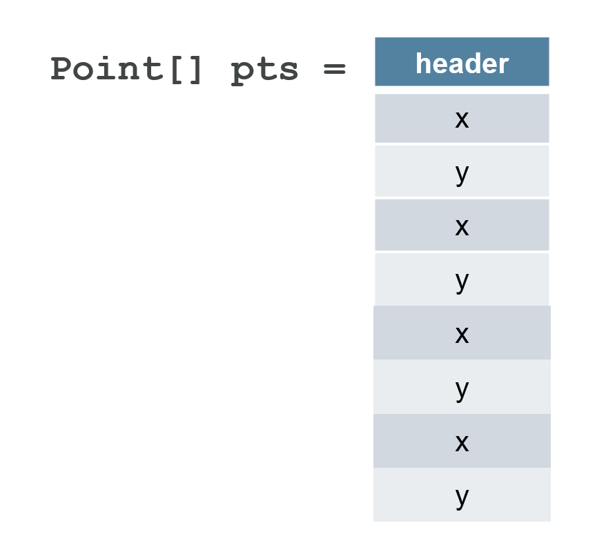

# State of Valhalla
## Part 1: The Road to Valhalla {.subtitle}

#### Brian Goetz {.author}
#### December 2021 {.date}

> _This is the first of three documents describing the current State of
  Valhalla.  The second is [The Language Model](02-object-model); the
  third is [The JVM Model](03-vm-model)._

## Background

[_Project Valhalla_][valhalla] got its start in 2014, with the goal of bringing
more flexible flattened data types to JVM-based languages, in order to restore
alignment between the programming model and the performance characteristics of
modern hardware.  (In some ways, it got started much earlier; the designers of
Java wanted to include value types in the initial version of the language.)

Valhalla anticipates adding three core features to the platform: _value
objects_, _primitive classes_, and _specialized generics_.  In the initial phase
of the project, we focused primarily on understanding how the language and JVM
would have to evolve to support these features, and what the migration
compatibility implications for user code would be.

While it is possible to release these features incrementally, it is necessary to
have an end-to-end picture of how they will all work together before committing
to an implementation.  We present here a path to enhancing the Java language and
virtual machine with value classes and primitive classes, migrating the existing
primitive types and value-based classes to make use of these features, and
allowing primitive types to interoperate cleanly with generics.  This set of
documents summarizes that path, to be delivered in stages.  The first three of
these are described in [a draft JEP][jep-values], [JEP 401][jep401], and [JEP
402][jep402].  (If you want to compare with where we started, see our [founding
document][values0].)

However, Project Valhalla is not just about the features it will deliver, or
about improving performance; it has the more ambitious agenda to _heal the rift_
between primitives and objects.  

### The costs of indirection

The JVM type system includes eight primitive types (`int`, `long`, etc.),
objects (heterogeneous aggregates with identity), and arrays (homogeneous
aggregates with identity).  This set of building blocks is flexible -- you can
model any data structure you need to.  Data that does not fit neatly into the
available primitive types (such as complex numbers, 3D points, tuples, decimal
values, strings, etc.), can be easily modeled with objects.  However, objects
are allocated in the heap (unless the VM can prove they are sufficiently
narrowly scoped and unaliased), require an object header (generally two machine
words), and must be referred to via a memory indirection.  For example, an array
of XY point objects has the following memory layout:

{ width=100% }

When the Java Virtual Machine was being designed in the early 1990s, the cost of
a memory fetch was comparable in magnitude to computational operations such as
addition.  With the multi-level memory caches and instruction-level parallelism
of today's CPUs, a single cache miss may cost as much as 1000 arithmetic issue
slots -- a huge increase in relative cost.  As a result, the pointer-rich
layouts favored by the JVM, which involves many indirections between small
islands of data, is no longer an ideal match for today's hardware.  We aim to
enable data layouts better suited to the performance model of today's hardware
by providing Java developers with an easier path to _flat_ (cache-efficient) and
_dense_ (memory-efficient) data layouts without compromising abstraction or type
safety.

What we would like is to have the option to get a layout more like this:

{ width=60% }

This layout is both flatter (no indirections) and denser (no headers) than the
previous version.  Project Valhalla offers us a natural way to get to this
layout, without having to obsessively focus on low-level details, by separating
out, and giving users control over, the semantic concerns that necessitate the
first layout.

Flattening is not only about layout in the heap; we can also flatten the _calling
convention_, which is how the JVM passes values from one method to another (on
the stack, or in registers).  In the absence of heroic JVM optimizations, when a
method passes a `Point` to another today, it passes a pointer and the callee
dereferences the pointer to access the object's state.  We would like a flatter
calling convention, where a `Point` can be passed by passing the `x` and `y`
components by value.  In some cases, calling convention flattening can yield
even more significant performance improvements than heap flattening.

### The costs of a split type system

As an object-oriented language, the separation between primitives and objects
embodies a significant compromise: an OO language would like to start from the
premise of "everything is an object".  But, as Java is specified today, an `int`
is not an object; it is something special and magical (and so are its arrays),
and this non-uniformity ripples throughout the language, libraries, and runtime.

The compromise made in 1995 was that _everything the user can define_ is an
object, but there are eight additional built-in types that are not objects, and
we cannot define new ones.  It was surely a forced move at the time; it was not
yet known how to get away with "everything is an object" and still offer
reasonable numeric performance.  It didn't seem so bad at the time, and we've
been able to accomplish great things despite it, but it is an ongoing tax on
developers, library designers, and users.

When generics came along in 2004, it got slightly better -- and a lot worse.
Autoboxing papered over some of the visible seams (though at a significant cost
to the complexity of overload resolution), so we could freely use an `int` where
an `Integer` was expected and vice-versa.  But this addressed only the surface
problem, not the underlying rift; the set of places where we had to be aware of
the rift between primitive and reference types grew, because primitives could
not be used as generic type parameters. Again, this was a pragmatic compromise
-- and the only way known at the time to add generics to Java without massive
compatibility pain -- but the ongoing tax only grew larger.

It got worse again when lambdas came along in 2014.  Lambdas build heavily on
generics, so many of the consequences faced by generics were inherited by
lambdas.  This rippled into the libraries: `java.util.function` suffers a
combinatorial explosion of hand-specialized versions (`IntPredicate`,
`IntToLongFunction`), rather than being able to parameterize more general types
(`Predicate<int>`, `Function<int, long>`).  The goal of generics is to abstract
over representational differences, but the primitive-reference divide was
getting harder to bridge.

### The costs of boxing

Java's eight built-in primitive types are not objects, but they have _boxes_.
When primitives want to interact in the world of objects,  we transparently
convert them to and from their corresponding box.   Primitives don't implement
interfaces like `Comparable` -- their boxes do.  `Object` is the top type -- but
only for classes.  So primitives cannot directly participate in generics or
dynamically typed libraries such as reflection (where everything is expressed as
`Object` or `Object[]`) -- they can only do so through their boxes.

Going through reference companions is not necessarily bad; the meaning of
`ArrayList<Integer>` is clear enough, and autoboxing lets us deal with such
types in a syntactically convenient way.  But there are sharp edges.  Objects
have identity, whereas primitives do not; boxing is not able to fully paper over
this gap.  Each time we convert from `Integer` to `int` the identity is lost,
and each time we convert from `int` to an `Integer`, a fresh (but accidental)
identity is created, which can inhibit valuable runtime optimizations.  While
`int` boxes to `Integer`, `int[]` does not box to `Integer[]`.  And the
relationships between primitives and their corresponding wrappers are entirely
ad-hoc (they're even sometimes, but not always, spelled the same way!); you just
have to keep this in your head (and in your code).

Developers know that boxing is not only irregular, but also costly; absent
heroic optimizations, boxing conversion entails heap allocation, and using
reference companion types as fields entails indirection.  Boxes have the same
problems as we saw with points above, just with smaller payloads.  

### And the costs roll on 

At the library level, developers face further difficult choices.  The most
fundamental libraries -- collections and streams -- are prime examples of the
tradeoffs that library designers have to navigate.  Collections reasonably made
the choice to avoid specializing for primitive types (there are libraries in the
ecosystem, such as `trove` or Eclipse Collections, that go the other way, and
that's fine too), and streams tried to walk a narrow line with hand-rolled
specializations for `int`, `long`, and `double`, but the existence of
`IntStream` at all is evidence of the contortions that library designers often
have to twist themselves into.  Worse, hand specialization begets more hand
specialization (`IntStream` gave rise to `IntToLongFunction` and
`PrimitiveIterator.OfInt`), and there are always calls for more ("where's my
`CharStream`?").  And hand-specialization almost always introduces asymmetries.
Finally, the mere existence of hand-specialized stream types was a significant
constraint on the design and implementation of the `java.util.stream` library.

> _Library designers are too often faced with the bad choice between good memory
behavior and good abstraction._

Users are not immune from having to reason about the gap between primitives and
boxes either.  Nearly every Java developer has written an ad-hoc, hand-rolled
equivalent of `ArrayList<int>`, because `ArrayList<Integer>` was not (or was
perceived to be not) good enough for the situation.  And this hand-rolled
version rarely has any connection to `List`, which inhibits interoperability and
further distorts any APIs that want to use it.  The tradeoff between good memory
behavior and good abstraction hits users as hard as it does library designers.

## The root cause

The unfortunate layout of `Point[]` above derives from _object identity_; that
all object instances are uniquely identified. Identity enables mutability; in
order to mutate a field of an object, we must know _which_ instance we are trying
to modify.  Identity also enables _layout polymorphism_, where subclasses share
a common layout prefix with their superclasses, allowing a subclass instance to
be safely operated on through a superclass reference.  Even for classes that
eschew mutability and layout polymorphism (which includes most immutable
concrete classes), identity can still be observed by various identity-sensitive
operations including object equality (`==`), synchronization,
`System::identityHashCode`, weak references, etc.  

Identity effectively requires that an instance live in exactly one place, and if
we want to access it, we go to the source.  This is why the `Point[]` layout is
full of pointers; the array elements are merely references to the actual object.
And identity requires that the VM pessimistically preserve this layout just in
case someone might eventually perform an identity-sensitive operation,
inhibiting many useful optimizations.  In the early 90s, "everything is an
Object" was an attractive mantra, and the performance costs of identity did not
seem onerous at the time, but over time, the costs have increased.

The basic feature of Valhalla is that some classes may disavow their identity.
An object that lacks identity is a _value object_, and its class is a _value
class_. These classes give up some flexibility -- for example, they must be
immutable and cannot be layout-polymorphic -- but in return are rewarded with
optimized performance. The lack of identity allows the JVM to freely copy and
re-encode these objects, preserving just their state and requiring fewer
indirections.

Despite the restrictions on mutability and subclassing, value classes can
use most mechanisms available to classes: methods, constructors, fields,
encapsulation, interfaces, generics, annotations, etc.

Additionally, some value classes may opt to represent a primitive type.
Primitive types can't be `null` and are less strongly encapsulated than
reference types. But their values are bare sequences of instance fields,
maximizing the JVM's ability to achieve flat, dense memory layouts and optimized
calling conventions. These so-called _primitive classes_ can combine the
expressive power of classes with the runtime behavior of primitives. The slogan
for Valhalla is:

> _Codes like a class, works like an int._

Unlike the basic primitive types (`int`, `double`, etc.), primitive types
declared by classes have fields and methods, and their values can be freely
converted to value objects, as needed, without the overhead and ad hoc nature
of boxing. Their arrays can be treated as object arrays.

There are applications for primitive classes and value classes at every level.
Aside from the obvious -- turning the built-in primitive types into real classes
-- many API abstractions, such as numerics, dates, cursors, and wrappers like
`Optional`, can be naturally modeled as value classes or primitive classes.
Additionally, many data structures can profitably use primitive classes in their
implementations to improve efficiency.  And language compilers can use them as a
compilation target for features like built-in numeric types, tuples, or multiple
return.
There are applications for value classes at every level.  Aside from the obvious
-- turning the built-in primitive types into real classes -- many API
abstractions, such as numerics, dates, cursors, and wrappers like `Optional`,
can be naturally modeled as value classes.  Additionally, many data structures
can profitably use value classes in their implementations to improve
efficiency.  And language compilers can use them as a compilation target for
features like built-in numeric types, tuples, or multiple return.

## What about generics?

One of the early compromises of Java Generics is that generic type variables can
only be instantiated with reference types, not primitive types.  This is both
inconvenient (we have to say `List<Integer>` when we mean `List<int>`) and
expensive (boxing has performance overhead).  With eight primitive types,
this restriction is something we learned to live with, but if we can write our
own flattenable data types like our `Point` above, having an `ArrayList<Point>`
not be backed by a flattened array of `Point` seems to defeat, well, the point.

Parametric polymorphism always entails tradeoffs between code footprint,
abstraction, and specificity, and different languages have chosen different
tradeoffs.  At one end of the spectrum, `C++` creates a specialized class for
each instantiation of a template, and different specializations have no
type-system relationship with each other. Such a _heterogeneous translation_
provides a high degree of specificity but entails a large code footprint as well
as a loss of abstraction -- there is no type that is the equivalent of `List<?>`
in Java.

At the other end of the spectrum, we have Java's current erased implementation
which produces one class for all reference instantiations and no support for
primitive instantiations.  Such a _homogeneous translation_ yields a high degree
of reuse, since there is only one class and one object layout for all
(reference) instantiations.  It carries the restriction that we can only range
over types that have a common runtime representation, which in Java is the set
of reference types.  This restriction has its roots deep in the design of the
JVM; there are different bytecodes for operations on reference vs primitive
values.

While most developers have a certain degree of distaste for [erasure][erasure],
this approach has a powerful advantage that we could not have gotten any other
way: _gradual migration compatibility_.  This is the ability to compatibly
evolve a class from non-generic to generic, without breaking existing sources or
binary class files, and leaving clients and subclasses with the flexibility to
migrate immediately, later, or never.  Offering users generics, but at the cost
of throwing away all their libraries, would have been a bad trade in 2004, when
Java already had a large and vibrant installed base -- and would be a worse
trade today.  

The plan for generics has two phases: [_universal generics_][jep-generics] and
_specialized generics_.  In the first phase, we heal the rift at the language
level that prevents us from using primitive types as generic type
parameters, allowing generics to range over all types -- but still implemented
via erasure. (This yields a more uniform and expressive language, but does not
yet optimize the performance -- though some boxing costs have already been
replaced with lighter-weight value object conversions.)  In the second phase, we
enable layout and code specialization in the JVM for generic classes and methods
-- while retaining the all-important gradual migration capability that made
generics successful the first time around.

## Moving forward

Project Valhalla has ambitious goals, and its intrusion is both deep and broad,
affecting the `class` file format, JVM, language, libraries, and user model. (In
2014, James Gosling described it as "six Ph.D theses, knotted together.") 

We intend to divide delivery of Project Valhalla into three broad phases:
identity-free [value objects][jep-values] first; then [primitive
classes][jep401], [migrating the existing primitives][jep402], and [universal
generics][jep-generics]; and finally specialized generics.  

[valhalla]: http://openjdk.java.net/projects/valhalla
[values0]: http://cr.openjdk.java.net/~jrose/values/values-0.html
[adventures]: https://www.youtube.com/watch?v=TkpcuL1t1lY
[adventures-slides]: http://cr.openjdk.java.net/~briangoetz/valhalla/Adventures%20in%20Parametric%20Polymorphism.pdf
[model3]: http://cr.openjdk.java.net/~briangoetz/valhalla/eg-attachments/model3-01.html
[jep-values]: https://openjdk.java.net/jeps/8277163
[jep401]: https://openjdk.java.net/jeps/401
[jep402]: https://openjdk.java.net/jeps/402
[jep-generics]: http://openjdk.java.net/jeps/8261529
[erasure]: ../in-defense-of-erasure.html
