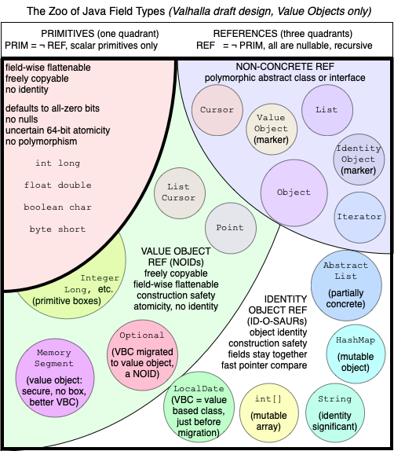
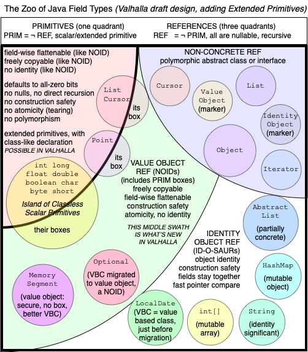

# State of Valhalla
## Part 2: The Language Model {.subtitle}

#### Brian Goetz {.author}
#### December 2021 {.date}

> _This is the second of three documents describing the current State of
  Valhalla.  The first is [The Road to Valhalla](01-background); the
  third is [The JVM Model](03-vm-model)._

This document describes the directions for the Java _language_ charted by
Project Valhalla.  (In this document, we use "currently" to describe the
language as it stands today, without value classes or extended primitives.)

Valhalla started with the goal of providing user-programmable classes which
could be flat and dense in memory.  Numerics are one of the motivating use
cases, but adding new primitive types directly to the language has a very high
barrier.  As we learned from [Growing a Language][growing] there are infinitely
many numeric types we might want to add to Java, but the proper way to do that
is as libraries, not as language features.

## Primitive and reference types in Java today

Java currently has eight built-in primitive types.  Primitives represent pure
_values_; any `int` value of "3" is equivalent to (and indistinguishable from)
any other `int` value of "3".  Values have no canonical location, and so are
_freely copyable_. With the exception of the unusual treatment of `NaN` values
for `float` and `double`, the `==` operator performs a _substitutibility test_
-- it asks "are these two values the same value?"

Java also has _objects_, and each object has a unique _object identity_. Because
of identity, objects are not freely copyable; each object lives in exactly one
place (at any given time), and to access its state we have to go to that place.
But we mostly don't notice this because objects are not manipulated or accessed
directly, but instead through _object references_.  Object references are also a
kind of value -- they encode the identity of the object to which they refer, and
the `==` operator on object references asks "do these two references refer to
the same object."  Accordingly, object _references_ (like other values) can be
freely copied, but the objects they refer to cannot.  

Primitives and objects differ in almost every conceivable way:

| Primitives                                 | Objects                            |
| ------------------------------------------ | ---------------------------------- |
| No identity (pure values)                  | Identity                           |
| `==` compares values                       | `==` compares object identity      |
| Built-in                                   | Declared in classes                |
| Not nullable                               | Nullable                           |
| No members (fields, methods, constructors) | Members (including mutable fields) |
| No supertypes or subtypes                  | Class and interface inheritance    |
| Accessed directly                          | Accessed via object references     |
| Default value is zero                      | Default value is null              |
| Arrays of primitives are monomorphic       | Arrays are covariant               |
| Tearable under race                        | Initialization safety guarantees   |
| Convertible to polymorphic objects         | Polymorphic                        |

The design of primitives represents various tradeoffs aimed at maximizing
performance and usability of the primitive types.  Reference types default to
`null`, meaning "referring to no object"; primitives default to a usable zero
value (which for most primitives is the additive identity).  Reference types
provide initialization safety guarantees against a certain category of data
races; primitives allow tearing under race for larger-than-32-bit values.  
We could characterize the design principles behind these tradeoffs are "make
objects safer, make primitives faster."

The following figure illustrates the current universe of Java's types.  The
upper left quadrant is the built-in primitives; the rest of the space is
reference types.  In the upper-right, we have the abstract reference types --
abstract classes, interfaces, and `Object` (which, though concrete, acts more
like an interface than a concrete class).  The built-in primitives have wrappers
or boxes, which are reference types.

<figure>
  <a href="field-type-zoo.pdf" title="Click for PDF">
    
  </a>
</figure>

Valhalla aims to unify primitives and objects in that they can both be
declared with classes, but maintains the special runtime characteristics
primitives have.  But while everyone likes the flatness and density that
user-definable value types promise, in some cases we want them to be more like
classical objects (nullable, non-tearable), and in other cases we want them to
be more like classical primitives (trading some safety for performance).  Over
time, it became clear that there was not a one-size-fits-all answer.  

## Value classes: separating references from identity

Many of the impediments to optimization that Valhalla seeks to remove center
around _unwanted object identity_.  The primitive wrapper classes have identity,
but not only is this identity not directly useful, it can be a source of bugs.
(For example, due to caching, `Integer`s can be accidentally compared correctly
with `==` just often enough that people keep doing it.)  Similarly, [value-based
classes][valuebased] such as `Optional` have no need for identity, but pay the
costs of having identity anyway.  

Our first step is allowing class declarations to explicitly disavow identity, by
declaring themselves as _value classes_.  The instances of a value class are
called _value objects_.  

```
value class ArrayCursor<T> { 
    T[] array;
    int offset;

    public ArrayCursor(T[] array, int offset) { 
        this.array = array;
        this.offset = offset;
    }

    public boolean hasNext() { 
        return offset < array.length;
    }

    public T next() { 
        return array[offset];
    }

    public ArrayCursor<T> advance() { 
        return new ArrayCursor(array, offset+1);
    }
}
```

This says that an `ArrayCursor` is a class whose instances have no identity.  As
a consequence, they must give up the things that depend on identity; the class
and its fields are implicitly final.  

But, value classes are still classes, and can have most of the things classes
can have -- fields, methods, constructors, type parameters, superclasses (with
some restrictions), nested classes, class literals, interfaces, etc.  The
classes they can extend are restricted: `Object` or abstract classes with no
fields, empty no-arg constructor bodies, no other constructors, no instance
initializers, no synchronized methods, and whose superclasses all meet this same
set of conditions.  (`Number` is an example of such a class.)

Value class types are still reference types; we refer to value objects via
object references.  This means that object references can refer to either
identity objects or value objects; for the types in the upper-right quadrant
(interfaces, abstract classes, and `Object`), references to these types might
refer to either an identity object or a value object.  (Historically, JVMs were
effectively forced to represent object references with pointers; for references
to value objects, JVMs now have more flexibility.)

Because they are reference types, value class types are nullable, their default
value is null, and loads and stores of references are atomic even in the
presence of data races, providing the initialization safety we are used to with
classical objects.

Because they are values, `==` compares value objects by state rather than
identity.  This means that value objects, like primitives, are _freely
copyable_; we can explode them into their fields and re-aggregate them into
another value object, and we cannot tell the difference.  (Because they have no
identity, some identity-sensitive operations, such as synchronization, produce
runtime exceptions.)

Value classes take aim at the first two lines of the table of differences above;
rather than identity being a property of all objects, it becomes a declared
property of classes, such as finality.  By allowing classes that don't need
identity to exclude it, we free the runtime to make better layout and
compilation decisions -- and avoid a whole category of bugs.

In looking at the code for `ArrayCursor`, we might mistakenly assume it will be
inefficient, as each loop iteration appears to allocate a new cursor:

```
for (ArrayCursor<T> c = Arrays.cursor(array); 
     c.hasNext(); 
     c = c.advance()) {
    // use c.next();
}
```

One should generally expect here that _no_ cursors are actually allocated.
Because an `ArrayCursor` is just its two fields, these fields will get hoisted
into registers, and the constructor call in `advance` will typically compile
down to incrementing one of these registers.

### Migration

The JDK (as well as other libraries) has many [value-based classes][valuebased],
such as `Optional` and `LocalDateTime`.  Value-based classes adhere to the
semantic restrictions of value classes, but are still identity classes -- even
though they don't want to be.  Value-based classes can be migrated to true value
classes simply by redeclaring them as value classes.  This is both source- and
binary-compatible.

We plan to migrate many value-based classes in the JDK to value classes.
Additionally, the primitive wrappers can be migrated to value classes as well,
making the conversion between `int` and `Integer` cheaper.  (In some cases, this
may be _behaviorally_ incompatible for code that synchronizes on the primitive
wrappers.  [JEP 390][jep390] has supported both compile-time and runtime
warnings for synchronizing on primitive wrappers since Java 16.)  

<figure>
  <a href="field-type-zoo.pdf" title="Click for PDF">
    
  </a>
</figure>

### Value records

While records have a lot in common with value classes -- they are final and
their fields are final -- they are still identity classes.  Records embody a
tradeoff: give up on decoupling the API from the representation, and in return
get various syntactic and semantic benefits.  Value classes embody another: 
give up identity, and get various semantic and performance benefits.  If
we are willing to give up both, we can get both sets of benefits:

```
value record NameAndScore(String name, int score) { }
```

Value records combine the data-carrier idiom of records with the improved 
scalarization and flattening benefits of value classes.  

In theory, it would be possible to apply `value` to certain enums as well, but
this is not currently possible because the `java.lang.Enum` base class that
enums extend does not meet the requirements for superclasses of value classes
(it has fields and non-empty constructors).

### Identity-sensitive operations

Certain operations are currently defined in terms of object identity.  Some of
these, like equality, can be sensibly extended to cover all object instances.
Others, like synchronization, will become partial.   Identity-sensitive
operations include:

  - **Equality.**  Two value objects are `==` if they are of the same type, and
    each of their fields are pairwise equal, where equality is given by `==` for
    primitives (except `float` and `double`, which are compared with
    `Float::equals` and `Double::equals` to avoid the `NaN` anomalies), `==` for
    references to identity objects, and recursively with `==` for references to
    value objects.  In no case is a value object ever `==` to an identity
    object.

  - **System::identityHashCode.**  The main use of `identityHashCode` is in the
    implementation of data structures such as `IdentityHashMap`.  We can extend
    `identityHashCode` in the same way we extend equality -- deriving a hash on
    primitive objects from the hash of all the fields.

  - **Object methods.** The default implementations of `toString`, `equals`, and
    `hashCode`, as defined by the class `Object`, are based on object identity.
    They can be modified, consistent with `==`, to be based on the object's
    field values instead.

  - **Synchronization.**  This becomes a partial operation.  If we can
    statically detect that a synchronization will fail at runtime (including
    declaring a `synchronized` method in a value class), we can issue a
    compilation error; if not, attempts to lock on a value object results in
    `IllegalMonitorStateException` at runtime.  This is justifiable because it
    is intrinsically imprudent to lock on an object for which you do not have a
    clear understanding of its locking protocol; locking on an arbitrary
    `Object` or interface instance is doing exactly that.

  - **Weak references.**  If we made creating weak references a partial
    operation on `Object`, weak references become almost useless, as every class
    that wants to maintain some sort of weak data structure would have to
    bifurcate into separate paths for identity and value objects.  (This would
    be similar to partializing `identityHashCode`.)  Weak references to value
    objects that contain no references to identity objects should never be
    cleared; weak references to value objects that contain references to
    identity objects should be cleared when those objects are no longer strongly
    reachable.

  - **Serialization.** Serialization currently uses object identity to preserve
    the topology of an object graph.  This generalizes cleanly to value objects,
    because `==` on value objects treats two identical copies of a value object
    as equal.   So any observations we make about topology prior to
    serialization, are consistent with those after deserialization.

### Identifying identity

To distinguish between primitive and identity classes at compile and run time,
we introduce two restricted interfaces `IdentityObject` and `ValueObject`.
`IdentityObject` is implicitly implemented by identity classes; `ValueObject` is
implicitly implemented by value classes; no class can implement both. This
enables us to write code that dynamically tests for object identity before
performing identity-sensitive operations:

```
if (x instanceof IdentityObject) {
    synchronized(x) { ... }
}
```

as well as statically reflecting the requirement for identity in variable types
(and generic type bounds):

```
static void runWithLock(IdentityObject lock, Runnable r) {
    synchronized (lock) {
        r.run();
    }
}
```

If an interface or abstract class implements `IdentityObject` or `ValueObject`,
this serves as a constraint that it may only be extended by the appropriate sort
of class.

### What about Object?

The root class `Object` poses an unusual problem, in that every class must
extend it directly or indirectly, but itself is (currently) an identity class,
and it is common to use `new Object()` as a way to obtain a new object identity
for purposes of locking.  If `Object` were to implement `IdentityObject`, then
primitive classes could not extend `Object` (and therefore could not
interoperate with dynamically typed libraries such as reflection).  We address
this problem by treating `Object` like we do interfaces and certain abstract
classes -- they can be extended by both identity and primitive classes -- but
redefine the idiom `new Object()` to evaluate to a fresh instance of an
_anonymous identity subclass_ of `Object`.

## Primitive classes

Value classes allow developers to give up one thing -- identity -- and gain a
host of performance and predictability benefits.  They are an ideal replacement
for many of today's value-based classes, fully preserving their semantics
(except for the accidental identity these classes never wanted).  But they
represent only one point on a spectrum of tradeoffs between abstraction and
performance, and other desired use cases -- such as numerics -- may want a
different set of tradeoffs.

Specifically, value classes still use _reference types_.  This means they are
nullable, and therefore must account for `null` somehow in their representation,
which may have a footprint cost.  Similarly, they still offer the initialization
safety guarantees that we've come to expect from classes, which also has a cost
to preserve.  For certain use cases, it may be desirable to additionally give up
something else to gain the maximum flatness and density possible -- and that
something else is reference-ness.

_Primitive classes_ allow us to define new primitive types, with essentially the
same runtime behavior as the basic primitives (`int`, `double`, etc.)

```
primitive class Point implements Serializable {
    int x;
    int y;

    Point(int x, int y) { 
        this.x = x;
        this.y = y;
    }

    Point scale(int s) { 
        return new Point(s*x, s*y);
    }
}
```

A primitive class is a special value class whose instances can be represented as
values of a primitive type.  The name of the class (`Point`) is also the name of
the primitive type.  Users of the primitive type can expect familiar primitive
semantics and performance -- for example, the primitive type cannot be `null`.

A primitive class declaration is subject to the same constraints as for value
classes (e.g., the instance fields are implicitly `final`). Additionally,
primitive type circularities in instance field types are not allowed --
flattened instances must not contain other instances of the same type.

Unlike the basic primitives, primitive types declared with classes can be used
as receivers to access the fields and invoke the methods of the class (modulo
accessibility): 

```
Point p = new Point(1, 2);
assert p.x == 1;

p = p.scale(2);
assert p.x == 2;
```

The `==` operator can be used to compare two primitive values of the same type;
it performs a pairwise comparison of the values' fields, just as for value
objects.

```
assert p.scale(2) == new Point(2, 4);
```

### Polymorphism

Primitive classes can extend abstract classes and implement interfaces. Yet
primitive values are bare, untagged data. How can they support polymorphism?
The answer is that instances of a primitive class can also be represented as
value objects, like instances of any other value class. These objects support
subtyping, virtual dispatch, etc.

Unlike most classes, a primitive class declares _two_ types: the primitive type
(`Point`) and a reference type (`Point.ref`). Both types have the same members.
Instances can be operated on in either form, as needed, and freely converted
between the two types.

In our diagram, primitive classes show up as another entity that straddles the
line between primitive values and value objects, alongside the basic primitives
and their boxes: 

<figure>
  <a href="field-type-zoo.pdf" title="Click for PDF">
    
  </a>
</figure>

Values of type `int`, `double`, etc., allow for _boxing conversion_ to the
wrapper class types, and _unboxing conversion_ back to the primitive types.
Similarly, an instance of a primitive class supports _value object conversion_
to the class's reference type, and _primitive value conversion_ back to the
class's primitive type. Like unboxing, a primitive value conversion will fail
on an attempt to convert `null`.

All classes declare a superclass type (`Object` by default) and a list of
superinterface types. These types set up a subtyping (is-a) relationship between
the class's reference type and the supertypes (we write `A <: B` to indicate A
is a subtype of B).  For a primitive class, the primitive type is monomorphic,
but the reference type has the expected subtyping relationship.

This means that if we declare:

```
primitive UnsignedShort extends Number 
                        implements Comparable<UnsignedShort> { 
   ...
}
```

then `UnsignedShort.ref <: Number`, and `UnsignedShort.ref <:
Comparable<UnsignedShort>`.  To assign an `UnsignedShort` to the type `Number`,
it first undergoes value object conversion to type `UnsignedShort.ref`, and then
the normal subtyping rules apply. 

The `instanceof` operator, pattern matching, and reflection work primarily with
classes, not types.  So we can reasonably ask a `Number` if it is an instance of
class `UnsignedShort`; and when we ask for its class, we may get
`UnsignedShort.class`.

```
UnsignedShort us = ...
Number n = us;
if (n instanceof UnsignedShort) {
    assert n.getClass() == UnsignedShort.class;
}
```

While primitive types are not _subtypes_ of reference types, we can introduce a
new relationship based on `extends` / `implements` clauses, which we'll call
_extends_.  We'll say `A` extends `B` means `A <: B` when A is a reference
type, and `A.ref <: B` when A is a primitive type.

### Arrays

Arrays of reference types are _covariant_; this means that if `A <: B`, then
`A[] <: B[]`.  This allows `Object[]` to be the "top array type", at least for
arrays of references.  But arrays of primitives are currently left out of this
story.

We can unify the treatment of arrays by defining array covariance over
the new "extends" relationship; if A extends B, then `A[] <: B[]`.  This means
that for a primitive P, `P[] <: P.ref[] <: Object[]`, making `Object[]` the top
type for all arrays.

Of course, if a `Point[]` _is-a_ `Object[]`, this means it has to support
reading and writing of references, even though the array actually stores
primitive values. Value object conversions (on reads) and primitive value
conversions (on writes) are thus dynamically applied, as needed, to support
the appropriate physical encodings. Attempting to store a `null` in a primitive
array will cause the primitive value conversion to fail.

### Default values

Fields and array components are always initialized to their _default value_
before a program has a chance to read or modify them. For reference types, this
value is `null`. But because primitive types cannot be `null`, the default value
of a primitive class's primitive type is the class's _initial instance_ -- an
instance with all field values set to their own default values.

The basic primitives (`int`, `double`, etc.) reflect the design assumption that
zero is a reasonable default.  If we choose to model an entity with a primitive
class, we are making the same assumption: that the zero representation is a
reasonable default.   

For some abstractions, such as `LocalDate`, there _is_ no reasonable default
other than `null`.  If we choose to represent a date as the number of days since
some epoch, there will invariably be bugs that stem from uninitialized dates;
we've all been mistakenly told by computers that something will happen on or
near 1 January 1970.  Even if we could choose a default other than the zero
representation, an uninitialized date is still likely to be an error.  For this
reason, `LocalDate` is better suited to being a value class than a primitive
class -- because not only is zero not a reasonable default, it has no reasonable
default.

The choice to use a zero default instead of `null` was one of the central
tradeoffs in the design of the basic primitives.  It gives us a usable
initial value (most of the time), and requires less storage footprint than a
representation that supports `null` (`int` uses all 2^32 of its bit patterns, so
a nullable `int` would have to either make some 32 bit signed integers
unrepresentable, or use a 33rd bit).  This was a reasonable tradeoff for the
basic primitives, and is also a reasonable tradeoff for many other potential
primitive types (such as complex numbers, 2D points, half-floats, etc.)

### Tearing

For the primitive types longer than 32 bits (`long` and `double`), it is not
guaranteed that reads and writes from different threads (without suitable
coordination) are atomic with respect to each other.  The result is that, if
accessed under data race, a `long` or `double` field or array component can be
seen to "tear", where a read might see the low 32 bits of one write, and the
high 32 bits of another.  (Declaring the containing field `volatile` is
sufficient to restore atomicity, as is properly coordinating with locks or other
concurrency control.) 

This was a pragmatic tradeoff given the hardware of the time; the cost of
atomicity on 1995 hardware would have been prohibitive, and problems only arise
when the program already has data races -- and most numeric code deals with
thread-local data.  Just like with the tradeoff of nulls vs. zeros, the design
of primitives permits tearing as part of a tradeoff between performance and
correctness, where primitives chose "as fast as possible" and objects chose more
safety.

Today's JVMs give us atomic loads and stores of 64-bit primitives, because the
hardware makes them cheap enough.  But primitive classes bring us back to 1995;
atomic loads and stores of larger-than-64-bit values are still expensive,
leaving us with a choice of "make operations on primitives slower" or permitting
tearing when accessed under race.  For the new primitive types, we choose to
mirror the behavior of the existing primitives.

Just as with `null` vs. zero, this choice has to be made by the author of a
class.  For classes like `Complex`, all of whose bit patterns are valid, this is
very much like the choice around `long` in 1995.  For other classes that might
have nontrivial representational invariants, the author may be better off
declaring a value class, which offers tear-free access because loads and stores
of references are atomic.

### Legacy primitives

As part of generalizing primitives, we want to adjust the basic primitives
(`int`, `double`, etc.) to behave as consistently with new primitives as
possible. We can start by declaring `int` as a primitive class, with methods
and supertypes. This class has a special keyword for a name, but otherwise can
behave like a standard primitive class.

We can't change the fact that existing code wants to refer to `int` value
objects with type `Integer`, but we can treat `Integer` as an alias for the more
uniform spelling `int.ref`. Then the legacy wrapper class `Integer` can be
replaced by the primitive class `int` (assuming all its public methods are
preserved in the new class).

### Why a reference type at all?

It is sensible to ask: why do primitive classes need a reference type at all?
The need for reference companions is analogous to the need for boxes in 1995:
we'd made one set of tradeoffs for primitives, favoring performance: they are
non-nullable, their default is zero, they can tear under race, they are
unrelated to `Object`, etc.  Most of the time, we ignored the box types, but
sometimes we needed to temporarily suppress one of these properties, such as
when interoperating with code that expects an `Object`.  The reasons we needed
boxes in 1995 still apply to primitive classes: most of the time, we will deal
with them as primitives, but sometimes we need the affordances of references
(nullability, non-tearability under race, polymorphism, self-reference), and in
those cases, we appeal to the reference type.  The expectation is that using
`P.ref` will be about as rare as using `Integer` explicitly today.

Reasons we might have to appeal to the reference type include: 

 - **Interoperation with other reference types.**  If primitive classes can
   implement interfaces and extend classes (including `Object` and some abstract
   classes), then some class and interface types are going to be polymorphic
   over both identity and value objects.  This polymorphism is achieved through
   object references -- a reference to `Object` may be a reference to an
   identity object, or a reference to a value object.  

 - **Nullability.**  Nullability is an affordance of object _references_, not
   objects themselves.  Most of the time, it makes sense that primitive types
   are non-nullable (as the primitives are today), but there may be situations
   where `null` is a semantically important value.  Using `P.ref` when nullability
   is required is semantically clear, and avoids the need to invent new sentinel
   values for "no value."

   This need comes up when migrating existing classes.  The method `Map::get`
   uses `null` to signal that the requested key was not present in the map --
   but if the `V` parameter to `Map` is a primitive class, `null` is not a valid
   value.  We can capture the "`V` or null" requirement by changing the
   descriptor of `Map::get` to:

   ```
   public V.ref get(K key);
   ```

   where, whatever type `V` is instantiated as, `Map::get` returns the reference
   companion. (For a type `V` that already is a reference type, this is just `V`
   itself.) This captures the notion that the return type of `Map::get` will
   either be a reference to a `V`, or the `null` reference. (This is a
   compatible change, since both erase to the same thing.)

 - **Self-referential types.**  Some types may want to directly or indirectly
   refer to themselves, such as the "next" field in the node type of a linked
   list:

   ```
   class Node<T> {
       T theValue;
       Node<T> nextNode;
   }
   ```

   We might want to represent this as a primitive class, but then the layout of
   `Node` would be self-referential, and since we want to flatten primitives
   into the layout of their enclosing types, this would lead to an infinite
   regress.  The solution is to explicitly opt for a reference, where we can use
   `null` to indicate that there is no next node:

   ```
   primitive Node<T> {
       T theValue;
       Node.ref<T> nextNode;
   }
   ```

 - **Protection from tearing.**  We may want to use the reference type when
   we are concerned about tearing.  We can use `P.ref` as a field or array
   component type to request reference semantics; because loads and stores of
   references are atomic, `P.ref` is immune to the tearing under race that `P`
   might be subject to.  (The `volatile` modifier offers an alternative solution
   for fields, but comes with some additional, possibly unwanted performance
   implications.)

 - **Consistency with existing boxing.**  Autoboxing is convenient, in that it
   lets us pass a primitive where a reference is required.  But boxing affects
   far more than assignment conversion; it also affects method overload
   selection.  The rules are design to prefer overloads that require no
   conversions over those requiring boxing (or varargs) conversions.  Having both
   a primitive and reference type for every primitive class means that these
   rules can be cleanly and intuitively extended to cover new primitives.

## Bringing primitives and objects closer together

While primitives and objects still have some differences, we can dramatically
reduce the size of the table of differences we started with.  Rather than
identity being a property of all objects, identity becomes a property objects
can opt into -- and the semantics of `==` follows from that choice.  Both
primitives and objects can be declared using classes.  We can give primitives
members, supertypes, and array covariance.  Which leaves us with a much smaller
set of differences: 

| Primitives                          | Objects                            |
| ----------------------------------- | ---------------------------------- |
| Not nullable; default value is zero | Nullable; default value is null    |
| Tearable under race                 | Initialization safety guarantees   |
| Convertible to polymorphic objects  | Polymorphic                        |

### Value classes vs. primitives

It is reasonable to ask, why would we introduce _two_ new forms of declaration,
value classes and primitive classes?  Couldn't one or the other be good enough?  

While we could of course get away with only one of these (we've been getting
away with neither for 25 years), whichever one we picked would be unsatisfying
for some of the desired use cases.  If we picked value classes only, new numeric
types would be burdened by the requirement to represent nulls (which has a
footprint cost) and to manage atomicity of loads and stores.  If we picked
primitives only, it would be very tempting to use primitives even when they are
not entirely appropriate, and users would be stuck with an inconvenient default
value or with objects that cannot protect their invariants when accidentally
shared under a data race.  There's a reason for the remaining rows in our
primitives-vs.-objects table; sometimes you want nulls, and sometimes not;
sometimes you can tolerate tearing to get maximum performance, and sometimes
not.  

How would we choose between declaring an identity class, value class, or
primitive?  Here are some quick rules of thumb: 

 - Use identity classes when we need mutability, layout extension, or locking;
 
 - Consider value classes when we don't need identity, but need nullity or have
   cross-field invariants; 
   
 - Consider primitives when we don't need identity, nullity, or cross-field
   invariants, and can tolerate the zero default and tearability that comes with
   primitives.

### Summary

Valhalla unifies, to the extent possible, primitives and objects.   The
following table summarizes the transition from the current world to Valhalla.

| Current World                               | Valhalla                                                     |
| ------------------------------------------- | ------------------------------------------------------------ |
| All objects have identity                   | Some objects have identity                                   |
| Fixed, built-in set of primitives           | Open-ended set of primitives, declared with classes          |
| Primitives don't have methods or supertypes | Primitives have classes, with methods and supertypes         |
| Primitives have ad-hoc boxes                | Primitives have regularized companion reference types        |
| Boxes have accidental identity              | Value objects have no identity                               |
| Boxing and unboxing conversions             | Value object and primitive value conversions, but same rules |
| Primitive arrays are monomorphic            | All arrays are covariant                                     |


[valuebased]: https://docs.oracle.com/javase/8/docs/api/java/lang/doc-files/ValueBased.html
[growing]: https://dl.acm.org/doi/abs/10.1145/1176617.1176621
[jep390]: https://openjdk.java.net/jeps/390
