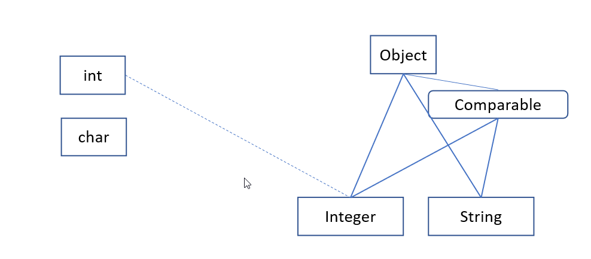
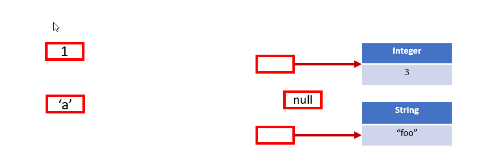
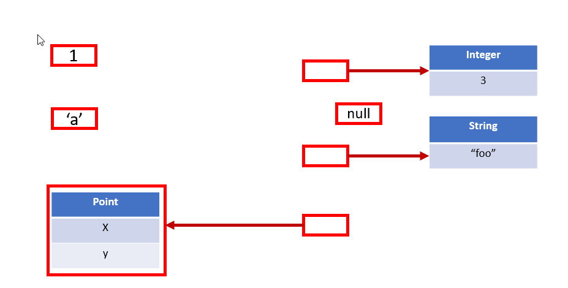
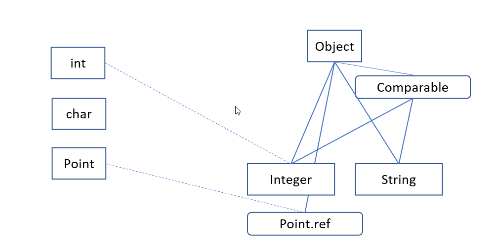

# State of Valhalla

#### Section 2: Unifying the Java Type System
#### Brian Goetz, Mar 2020

::: sidebar
Contents:

1. [The Road to Valhalla](01-background.html)
2. [Unifying the Java Type System](02-object-model.html)

:::

This document describes the directions for the Java _language_ charted by
Project Valhalla.  (In this document, we use "currently" to describe the
language as it stands today, without primitive types.)

## Primitive and reference types

The Java type system circa Java 1.0 has eight primitive types (integer and
floating point numbers of various sizes, booleans, and characters),
user-declared classes and interfaces (including the special root class
`Object`), and a type operator `[]` for "array of" that can operate
on any type (including array types.)  Types that are not primitive types
are called _reference types_.   

Reference and primitive types differ in almost every conceivable way.  Reference
types have _members_ (methods and fields) and supertypes (superclasses and
interfaces), and all (directly or indirectly) extend `Object`; primitive types
have no members and are "islands" in the type system, with no supertypes or
subtypes.  Arrays of reference types are covariant (`String[]` is a subtype of
`Object[]`); arrays of primitives are not.  To connect primitive types to
reference types, each primitive type is associated with a _wrapper_ type
(`Integer` is the wrapper type for `int`).  Wrapper types are reference types,
and so can have members and can participate in subtyping.  There are _boxing_
and _unboxing_ conversions between a primitive type and its corresponding
wrapper type.  The following diagram shows the type system we currently have,
where the solid lines represent subtyping and the dotted lines represent boxing
and unboxing conversions.

{ width=100% }

#### Value sets

Every type has a _value set_; this is the set of values that can be stored in a
variable of that type.  (For example, the value set of a primitive such as `int`
is the set of 32 bit integers.)  We write $Vals(T)$ to describe the value set of
type `T`.  If type `T` is a subtype of type `U`, then $Vals(T) \subseteq
Vals(U)$.

An _object_ is an instance of a class; currently, all objects have a unique
_object identity_.  The value set for a reference type consists not of
_objects_, but of _references to objects_; the possible values of a variable of
type `String` are not the `String` objects themselves, but references to those
`String` objects.  (It may come as a surprise to even experienced Java
developers that it is not possible to store, manipulate, or access objects
directly; we're so used to dealing with object references that we don't even
notice the difference.  Indeed, it is a common "gotcha" question about whether
Java objects are passed by value or by reference, and the answer is "neither":
_object references_ are passed  _by value_.)

> The value set of primitive types consists of primitive values; the value set
of reference types consists of references to object instances, or null.

To highlight the values that we can store in variables in Java programs, the
following diagram shows representable values as red boxes:

{ width=100% }

> The universe of values currently consists of _primitive values_ and
_references to objects_.

To summarize the current world:

  - Types are divided into primitive and reference types;
  - Reference types are those that are not primitive types, including declared
    classes and interfaces, array types, and parameterizations of generic
    classes and interfaces;
  - Primitives have a corresponding wrapper type, which is a reference type, and
    there are boxing and unboxing conversion between primitive types and their
    corresponding wrappers;
  - The value set of primitive types never includes `null`;
  - The value set of reference types consists not of objects, but of
    _references_ to objects, and always includes `null`;
  - Objects have object identity.

Project Valhalla will subtly realign this division so that we can unify
primitives with classes, but maintain the runtime behavior of today's
primitives, and allow us to declare new classes that have the runtime behavior
of primitives.

## Java's original sin

As an OO language, the separation between primitive and reference types embodies
a significant compromise: an OO language would like to start from the premise of
"everything is an object".  But, an `int` is not an object; it is something
special and magical unto itself (and so are its arrays), and this nonuniformity
ripples throughout the language, libraries, and runtime.

The compromise made in 1995 was that _everything the user can define_ is an
object, but there are eight additional built-in types that are not objects, and
we cannot define new ones.  It was surely a forced move at the time; it was not
yet known how to get away with "everything is an object" and still offer
reasonable numeric performance.  It didn't seem so bad at the time, and we've
been able to accomplish great things despite it, but it is an ongoing tax on
developers, library designers, and users.

When generics came along in 2004, it got slightly better -- and a lot worse.
The "better" part is that autoboxing papered over some of the visible seams
(though at a significant cost to the complexity of overload resolution), so we
could freely use an `int` where an `Integer` was expected and vice-versa.  But,
this addressed only the surface problem, not the underlying rift;  the set
of places where we had to be aware of the rift between primitive and reference
types grew, because primitives could not be used as generic type parameters.
Again, this was a pragmatic compromise -- and the only way known at the time to
add generics to Java without massive compatibility pain -- but the ongoing tax
only grew larger.

It got worse again when lambdas came along in in 2014.  Lambdas build heavily on
generics, so many of the consequences faced by generics were inherited by
lambdas.  This rippled into the libraries; `java.util.function` suffers a
combinatorial explosion of hand-specialized versions (`IntPredicate`,
`IntToLongFunction`), rather than being able to parameterize more general types
(`Predicate<int>`, `Function<int, long>`.)  The goal of generics is to abstract
over representational differences, but the primitive-reference divide was
getting harder to bridge.

#### Costs at every layer

The primitive-reference divide has consequences at nearly every level of the
platform.

At the classfile level, a significant amount of the surface area is dedicated to
primitives.  Not only do the primitive types each have their own special type
descriptors, but over 60% of the bytecodes are some sort of primitive-specific
operation (e.g., `iload`, `dmul`, `fstore`, `i2l`).  This helped in the days
when Java was interpreted and the JVM could identify the primitive operations
easily, but interpretation gave way to JIT compilation only two years later.

At the language level, primitives and objects differ in almost every way.
Objects have members such as fields and methods; primitives do not.  Objects
have identity; primitives do not.  Object references are nullable; primitives
are not.  Objects participate in polymorphism through superclasses and
interfaces; primitives cannot (even though it would be quite sensible for `int`
to implement `Comparable`).  `Object` is the top type -- but only for classes
(and the same problem presents for arrays; `Object[]` is the top type for arrays
of class types, but not for arrays of primitives).  The lack of subtyping with
`Object` means that primitives cannot directly participate in dynamically typed
libraries such as reflection (where everything is expressed as `Object` or
`Object[]`) -- they can only do so through their wrapper companions.

Having to go through the wrapper companions is not intrinsically terrible; the
meaning of `ArrayList<Integer>` is clear enough, and autoboxing lets us deal
with such types in a syntactically convenient way.  But objects have identity
whereas primitives do not, and boxing is not able to fully paper over this gap.
Each time we convert from `Integer` to `int` the identity is lost, and each time
we convert from `int` to an `Integer`, a fresh (but accidental) identity is
created.  While `int` boxes to `Integer`, `int[]` does not box to `Integer[]`.
And the relationship between primitives and their corresponding wrappers are
entirely ad-hoc (they're even sometimes, but not always, spelled the same way!);
you just have to keep this in your head (and in your code.)

At the library level, developers face further difficult choices.  The most
fundamental libraries -- collections and streams -- are prime examples of the
tradeoffs that library designers have to navigate.  Collections reasonably made
the choice to avoid specializing (there are libraries in the ecosystem, such as
`trove` or Eclipse Collections, that go the other way, and that's fine too), and
streams tried to walk a narrow line with hand-rolled specializations for `int`,
`long`, and `double`, but the existence of `IntStream` at all is evidence of the
contortions that library designers often have to twist themselves into.  Worse,
hand specialization begets more hand specialization (`IntStream` gave rise to
`IntToLongFunction` and `PrimitiveIterator.OfInt`, and there are always calls
for more ("where's my `CharStream`?").)  And hand-specialization almost always
introduces asymmetries.  Finally, the mere existence of hand-specialized stream
types was a significant constraint on the design and implementation of the
library.

> Library designers are too often faced with the bad choice between good memory
behavior and good abstraction.

Users are not immune from having to reason about the gap between primitives and
objects either.  Nearly every Java developer has written an ad-hoc, hand-rolled
equivalent of `ArrayList<int>`, because `ArrayList<Integer>` is not (or is
perceived to be not) good enough for the situation.  And this hand-rolled
version rarely has any connection to `List`, which often distorts any APIs that
want to use it.  The tradeoff between good memory behavior and good abstraction
hits users as hard as it does library designers.

> The gap between primitives and objects is the original sin of Java; it's time
to address this.

#### Squaring the circle?

The path forward is to address the problem at the root -- the gap(s) between
primitives and classes.  Boxing purported to fill this gap, but in doing so, it
created new gaps of its own -- syntactic (having to convert between `int` and
`Integer`), semantic (converting back and forth doesn't always mean the same
thing, primarily because boxes have accidental object identity), and performance
(boxing is expensive, again in part because of accidental object identity.)
Autoboxing may paper over the syntactic gap, but the semantic and performance
gaps remain.

Given that boxing seems to involved in all of the problems, it might be tempting
to say "then let's just get rid of boxing", but of course such "bold" thinking
skips over the hard part of having a clear story of what to replace it with.
Instead, we restore order by generalizing primitives to be full classes, called
_primitive classes_, but special classes that lack object identity.

Then we upgrade (or downgrade, depending on your perspective) the existing
primitives and their wrappers to be primitive classes.  We can allow users to
write their own primitive classes, which have the abstractive power of classes,
but the performance of primitives.  Finally, we will _generalize generics_, so
that all types (including primitives) can be used as type arguments, eliminating
the need for hand-rolled specializations such as `ToIntFunction` and
`LongStream`.

#### The root cause: object identity

We've already cited a number of differences between objects and primitives:

 - Objects can only be accessed through an indirection known as an _object
   reference_, whereas primitives are accessed and stored directly ("by value");
 - Object references can be null, whereas primitive values cannot;
 - Objects have identity, whereas primitives do not;
 - Objects can be polymorphic by extending classes or implementing interfaces,
   whereas primitives cannot;
 - Classes can have members (methods and fields), whereas primitives cannot;
 - Classes can have mutable state, whereas primitives cannot.

Given this array of differences, it seems daunting to try and unify primitives
with classes.  But most of these differences stem from a single root cause --
_object identity_.  If we can incorporate object identity (or the lack thereof)
more explicitly into the object model, we can derive most of these behaviors
from a unified view of classes and objects.

Object identity exists primarily to serve mutability and polymorphism (even
though not all classes will avail themselves of these features.)  The need to
support these essentially forces us to keep objects "at arms length", only
interacting with them through _object references_.  Null is not an instance of
any class; nullability is a property of accessing instances through references;
it is referring to objects via references that introduces nullability.

We can reframe our view of classes and objects to support the notion that not
all classes intend for their instances to have object identity; whether or not
instances have identity can be just one property of a class.  

If we take away the assumption that all objects have identity, this opens up a
new representational possibility: objects without identity can be represented
directly (inline, or by value) as primitives are today.  On the other hand, the
same objects can _also_ be represented indirectly via references, as the
primitive wrappers are today.  In this view, the primitives we know today are
analogous to a by-value representation of an instance of an identity-free class,
and the corresponding primitive wrapper is analogous to a by-reference
representation of _that same instance_.  Whereas boxing is a wholesale
conversion to an unrelated form involving the creation of an accidental
identity, we can turn this into the simpler difference between describing _the
same_ instance by value or by reference.  This is more semantically transparent
(no accidental identity is created or discarded), and the JVM can optimize this
far more effectively.

## Primitive classes

We call these classes whose instances have no identity _primitive classes_.
(This name may take some getting used to, since we're so used to thinking of
primitives as being the eight built-in types.)  Instances of primitive classes
are then called _primitive objects_.  (And so we finally arrive at the OO
nirvana -- everything is an object -- only 25 years later.)  The dichotomy of
"primitives vs classes" gives way to "primitive classes vs identity classes."
Having given up identity, the JVM is free to _inline_ (flatten) their layout
into other object and array layouts, and in general, represent or pass them by
value, giving us the optimized layout we want.

```
primitive class Point {
    int x;
    int y;

    public Point(int x, int y) {
        this.x = x;
        this.y = y;
    }
}
```

Primitive classes are implicitly `final`, cannot be `abstract`, can implement
interfaces, can only extend `Object` or certain abstract classes, and their
fields are implicitly `final`.  They can still have almost all the trappings of
classes -- type variables, static and instance fields, constructors, static and
instance methods, nested classes, etc.  Member inheritance works exactly the
same way for primitive classes as for identity classes.  (The abstract classes
that a primitive class can extend are those with no fields, empty no-arg
constructor bodies, no other constructors, no instance initializers, no
synchronized methods, and whose superclasses all meet this same set of
conditions (`Object` and `Number` are examples of such classes.))

> The slogan for primitive classes is _codes like a class, works like an int_.

At runtime, the behavior of certain core operations have been generalized to
distinguish between identity and primitive objects.  The `==` operator currently
asks whether the two operands are references to the same object.  We can
generalize this by observing that `==` performs a _substitutibility test_ on
objects -- it asks _whether there is any way to distinguish the two objects_.
Extending this to cover primitive objects is fairly straightforward: two
primitive objects are considered `==` if they are instances of the same class
with the same state.  (Since primitive classes model _values_, there is no
upside -- in fact, there is downside -- to having multiple distinct instances
that model the number "3".)  Similarly, the `identityHashCode` operation (used
in the implementation of `Object::hashCode`) computes the hash code for
primitive objects based on their state rather than their identity.

#### Types, and terminology

The current situation allows us to be relatively sloppy in our terminology,
because primitives and classes are different in almost every way.  The
distinctions between objects and references to those objects, or between classes
and types, are often blurred.  Similarly, "reference type" and "class types" and
"object types" mean (almost) the same thing and are often used interchangeably
with little loss of precision.  In the new world, we'll need some more precise
terminology, because two significant things have changed:

 - not all objects have identity
 - not all objects must be referred to by reference (though all can)

Classes are either _identity classes_ or _primitive classes_; instances of
classes are either _identity objects_ or _primitive objects_.  Identity objects
can only be described by reference; primitive objects can either be described
directly (by value) or by reference.  We can update our values diagram as
follows, to show that instances of primitive classes can be represented either
by reference or by value:

{ width=100% }

Classes give rise to _types_; when we declare `class C`, this gives rise to a
type called `C` which consists of references to instances of `C`.  In Java 1.0,
classes and types existed in 1:1 relation; when generics were added, a single
class `C<T>` gave rise to an infinite family of types (`C<String>`,
`C<Integer>`, `C<?>`.)  We now extend this one-to-many relationship further, by
saying that a primitive class gives rise to two (families of) types, one
consisting of primitive objects, and the other consisting of references to those
primitive objects.  We call these _primitive value types_ and _primitive
reference types_.  Most of the time, we'll want to use the primitive value type,
so for a primitive class `P`, the type `P` will be the primitive value type
corresponding to `P` -- but in some cases we may want to specify this more
explicitly.  The term _reference type_ continues to mean any type which consists
of references to objects, which now also includes the primitive reference types.
Reference types continue to be nullable; primitive value types are not nullable.
The eight legacy primitives will be called the _built-in primitives_ going
forward.  We can update our value set diagram to capture this:

{ width=100% }

The terminology of value vs reference type is intended to evoke the familiar
distinction between _pass by value_ and _pass by reference_, but is generalized
to cover not only passing of values between methods, but the storage properties
of variables (whether in the heap, on the stack, or in registers) as well.

Most of the time, we will not have to explicitly choose between primitive
reference and primitive value types, but in some cases, we will want to select
them  explicitly.  For a primitive class `P`, we will denote the corresponding
primitive value type by `P.val` and the corresponding primitive reference type
by `P.ref`, and `P` will (usually) be an alias for `P.val`.  It should only be
in rare cases that code will have to explicitly name the `.ref` and `.val`
types.  There is an automatic widening conversion from `P.val` to `P.ref`
(similar to boxing) and a narrowing conversion from `P.ref` to `P.val` (similar
to unboxing.)

Every type has a _default value_.  For the built-in primitives, the default
value is some sort of zero (`0`, `0.0`, `false`, etc); for reference types, the
default value is `null`.  For primitive classes, the default value is the
instance of that type where all fields take on the default value for their type.
For any class type `C`, the default value of `C` may be denoted as `C.default`.

#### Why do we need primitive reference types?

It is sensible to ask at this point, why do we need the primitive reference
types at all?  Why not just have primitive value types, and reference types only
for identity classes?  There are several reasons why references to primitive
objects are important to have, even if they will be used somewhat rarely.

 - **Nullability.**  Nullability is a property of object _references_, not
   objects themselves.  Most of the time, it makes sense for primitive classes
   to be non-nullable (as the primitives are today), though there may be
   situations where null is a semantically important value, but for which we
   want to disavow identity (and gain the benefits that flow from that.)  Using
   `P.ref` when nullability is required is semantically clear, and avoids the
   need to invent new sentinel values for "no value."

   This need may come up when migrating existing classes, such as the method
   `Map::get`, which uses `null` to signal that the requested key was not
   present in the map.  But, if the `V` parameter to `Map` is a primitive class,
   `null` is not a valid value.  We can capture the "`V` or null" requirement
   by changing the descriptor of `Map::get` to be:

```
public V.ref get(K key);
```

   This captures the notion that the return type of `Map::get` will either be a
   reference to a `V`, or the `null` reference.  (This is a compatible change,
   since both erase to the erasure of `V`.)

 - **Non-flattening is sometimes desirable.**  Most primitive classes will be
   relatively small aggregates, such as the `Point` example above.  However,
   some may be larger.  If we have an array of a "large" primitive class, the
   memory footprint of the array will be proportionally larger than of an array
   of the corresponding reference type.  This may not always be what is desired;
   if the array is sparse, this creates undue memory pressure, and even if not,
   sorting such an array may actually be slower, since swapping two elements
   involves moving much more data than swapping two references.  Sometimes we
   really want an array of `P.ref`.  (Similarly, when generics are eventually
   specialized, we may wish to explicitly specify that we don't want to inline
   the representation of the type parameter into the resulting type;
   `Foo<P.ref>` is a natural way to specify that.)

 - **Interoperation with Object and interface types.**  If primitive classes can
   implement interfaces, than an interface type is going to be polymorphic over
   both identity and primitive objects.  Interfaces achieve this polymorphism
   through object references, so in order to bring primitive objects under the
   umbrella of interfaces, we need to be able to represent them with object
   references.  (The special top type `Object` is the same; it is often helpful
   to think of `Object` as an "honorary interface.")

 - **Self-reference.**  Some types, such as the "next" field in the "node" type
   of a linked list, may want to directly or indirectly refer back to the type
   of the enclosing type, but circularities in the definition of primitive
   classes are not allowed (because that would make their layout of
   indeterminate size).  This can be done via a primitive reference type:

```
primitive class Node<T> {
    T element;
    Node.ref<T> next;
}
```

 - **Compatible migration.**  Some classes, such as `Optional`, are good
   candidates for migration to being primitive classes, and we would like for
   this to be a binary- and source-compatible change.  The type `Optional` today
   consists of object references; to make this a compatible migration, we would
   have to make the type `Optional` tomorrow consist of references to primitive
   objects.  We don't want to burden all primitive classes with the additional
   weight necessary to support compatible migration; we want only the migrated
   classes to bear this burden.

 - **No sensible zero.**  We can mechanically give each primitive class a
   default value, based on the default values of its fields.  For some classes,
   such as `Complex`, this zero value is a sensible member of the domain, but
   for others (such as `Rational`), this value may be nonsensical or even
   dangerous.  In some cases, we would prefer the behavior that we get from
   reference types today -- that if you dereference an uninitialized (null)
   reference, you fail with `NullPointerException`.  For classes for which the
   default value is dangerous, we can use the corresponding primitive reference
   class to ensure fail-fast behavior for uninitialized values.

 - **Compatibility with existing boxing.**  Autoboxing is convenient, in that it
   lets us pass a primitive where a reference is required.  But boxing affects
   far more than assignment conversion; it also plays into method overload
   selection, for example.  The rules are carefully design to prefer overloads
   that require no conversions to overloads that require boxing (or varargs)
   conversions.  Having both a value and reference type for every primitive
   class means that these rules can be cleanly and intuitively extended to cover
   user-written primitive classes.

It may appear that all we did here was to "rename" boxing in a complicated way
(and if we did this entirely through compiler trickery, that would be true.)
What has changed here is that the JVM has also been upgraded to understand the
notion of primitive classes, and the relationship between primitive value types
and their corresponding primitive reference type (and more), so that
user-written primitives can have the performance of the built-in ones, and this
"new boxing" has better performance than the old boxing.  This mostly comes down
to the JVM understanding that primitive objects do not have object identity, and
therefore the JVM can more easily optimize how they are stored in memory, how
their method invocations are dispatched, and how they are passed between methods
(such as by scalarization.)

> Rather than back away from boxing, we double down on it by making it more
> regular and optimizable.

#### Rationalizing arrays

If `C extends D` (or `C implements D`), then `C[] <: D[]` -- this is called
_array covariance_.  But, there are some gaps when it comes to arrays of
primitives.  We can box an `int` to an `Integer`, but we can't box an `int[]` to
an `Integer[]`.  `Object[]` is the top array type -- because of covariance --
but only for arrays whose components are reference types, because primitives do
not (today) extend `Object`.   When primitives become classes (and extend
`Object`), we can fix that.  For a primitive class `P` that extends (or
implements) `D`, `P[] <: P.ref[]`, and `P[] <: D[]`.

#### Migration from identity classes to primitive classes

Some classes, such as `Optional`, were originally implemented as identity
classes, but with the intention that some day they could become primitive
classes.  (These classes often include a disclaimer in their specification that
they are
[_value-based_](https://docs.oracle.com/javase/8/docs/api/java/lang/doc-files/ValueBased.html);
this captures most of the requirements for a compatible migration to primitive
classes.)

However, to the extent these classes appear in APIs (such as the return type of
a method), the existing semantics are that of reference types, not primitive
types; it is allowable for an `Optional` to be `null`.  So when these classes
are migrated to primitives, we must arrange that the unadorned name corresponds
to the primitive _reference_ type, rather than corresponding to the primitive
value type (which is the sensible default for new code.)  For migration
compatibility,  we need a way to declare a primitive class such that the class
name is an alias for the primitive reference type rather than the primitive
value type.  We might declare this (syntax TBD) as:

```
primitive-reference class Optional<T> { ... }
```

or maybe

```
primitive class Optional.ref<T> { ... }
```

or perhaps

```
ref-default primitive class Optional<T> { ... }
```

The only difference here is that the undecorated name -- `Optional` -- is an
alias for `Optional.ref` rather than `Optional.val`.  This allows such a
migration to be source- and binary-compatible; implementations could use
`Optional.val` internally for describing variables to get maximal flattening and
density, but the API could continue to work in terms of `Optional`, and the
widening and narrowing conversions would make up the difference.

#### Migrating the built-in primitives

If Java's original sin is the division between primitive and reference types, we
don't want to solve this problem by ending up with _three_ kinds of types.  We
want for the built-in primitive types to "just" be predefined primitive classes.
There are a few rough edges we need to file down in order to achieve this.  We
would like to be able to declare `Integer` as an ordinary (migrated) primitive
class, just as we did with `Optional`:

```
primitive-reference class Integer {
    private int value;
    ...
}
```

Because of the ad-hoc relationship between `int` and `Integer`, we need to do a
little more.  The type `int` becomes an alias for `Integer.val`, and `int.ref`
becomes an alias for `Integer`.  Another aspect of "special pleading" required
for this migration is that the primitive classes corresponding to the built-in
primitive types are allowed to refer to their corresponding built-in primitive
type in their declaration; ordinarily this sort of circularity would be banned.

There is one significant price to pay for this migration: synchronization on
instances of `Integer` will no longer be supported, instead throwing
`IllegalMonitorStateException`.  This is not a behaviorally compatible change,
but based on analysis of existing codebases, synchronizing on wrappers is rare
-- and usually a mistake.  Similarly, the constructors for the primitive wrapper
types, which were deprecated in Java 9, will be deprecated for removal, which is
not a binary-compatible change.  While we do not take making any incompatible
change lightly, the benefit of unifying primitives with objects is significant
and may justify this incompatibility.

#### Identity-sensitive operations

Certain operations are currently defined in terms of object identity.  As we've
already seen, some of these, like equality, can be sensibly extended to cover
all object instances.  Others, like synchronization, will become partial.  These
include:

  - **Equality.**  We totalize `==` on `Object`; where it currently has a
    meaning, the new definition coincides with that meaning.  
  - **System::identityHashCode.**  The main use of `identityHashCode` is in the
    implementation of data structures such as `IdentityHashMap`.  We can
    totalize `identityHashCode` in the same way we totalize equality -- deriving
    a hash on primitive objects from the hash of all the fields.
  - **Synchronization.**  This becomes a partial operation.  If we can
    statically detect that a synchronization will fail at runtime (including
    declaring a `synchronized` method in an primitive class), we can issue a
    compilation error; if not, attempts to lock on a primitive instance results in
    `IllegalMonitorStateException` at runtime.  This is justifiable because it
    is intrinsically imprudent to lock on an object for which you do not have a
    clear understanding of its locking protocol; locking on an arbitrary
    `Object` or interface instance is doing exactly that.
  - **Object::wait and Object::notify.**  Same as for synchronization.
  - **Weak references.**  If we made creating weak references a partial
    operation on `Object`, weak references become almost useless, as every class
    that wants to maintain some sort of weak data structure would have to
    bifurcate into separate paths for identity and primitive objects.  (This would
    be similar to partializing `identityHashCode`.)  Weak references to primitive
    objects that contain no references to identity objects should never be
    cleared; weak references to primitive objects that contain references to
    identity objects should be cleared when those objects are no longer strongly
    reachable.

As noted earlier, we haven't finished extending `==` for primitive objects,
because we haven't dealt with the case where a field of a primitive class is of
type `Object` (or abstract type) which can hold a reference to either a
primitive or identity class.  We do this by saying that two object references
are equal if they are both null, or are both references to the same identity
object, or are both references to inline objects that are `==` to each other.
This extends the _substitutability_ semantics of `==` to all values -- two
values are `==` only if it is not possible to distinguish between them in any
way (excepting the legacy behavior of `NaN`.)

This gives us the following useful invariants about `==` (all modulo the legacy
behavior of `NaN`):

   - `==` is reflexive -- for all `v`, `v == v`;
   - when two inline values are widened to references, the results are `==` if
     and only if the initial values were;
   - when two non-null references are narrowed to inline objects, the results
     are
     `==` if and only if the original references were.

The base implementation of `Object::equals` is to delegate to `==`; for an
inline class that does not explicitly override `Object::equals`, this is the
default we want.  (Similarly, the base implementation of `Object::hashCode`
delegates to `System::identityHashCode`; this is also the default we want.)

#### Identifying identity

To distinguish between primmitive and identity classes at compile and run time,
we introduce a restricted interface `IdentityObject`, which is implicitly
implemented by identity classes and cannot be implemented by primitive classes.
This enables us to write code that dynamically tests for object identity before
performing identity-sensitive operations:

```
if (x instanceof IdentityObject)) {
    synchronized(x) { ... }
}
```

as well as statically reflecting the requirement for identity in variable types
(and generic type bounds):

```
static void runWithLock(IdentityObject lock, Runnable r) {
    synchronized (lock) {
        r.run();
    }
}
```

If an interface or abstract class implements `IdentityObject`, this serves as a
constraint that it may only be extended by identity classes.

#### What about Object?

The root class `Object` poses an unusual problem, in that every class must
extend it directly or indirectly, but itself is (currently) an identity class,
and it is common to use `new Object()` as a way to obtain a new object identity
for purposes of locking.  If `Object` were to implement `IdentityObject`, then
primitive classes could not extend `Object` (and therefore could not
interoperate with dynamically typed libraries such as reflection).  We address
this problem by treating `Object` like we do interfaces and certain abstract
classes -- they can be extended by both identity and primitive classes -- but
redefine the idiom `new Object()` to evaluate to a fresh instance of an
_anonymous identity subclass_ of `Object`.

#### Class mirrors

A primitive class `P` gives rise to two distinct types (`P.ref` and `P.val`,
plus the type alias `P`, which is aliased to one or the other), and so it also
gives rise to two distinct class mirrors.  However, no instance will ever report
that it is an instance of `P.ref`; a non-null reference to a value of `P` will
always report that it is an instance of `P.val`.  

The role of `P.ref.class` is similar to (though the dual of) the role of
`int.class` today.  No object ever reports it is an instance of `int.class`;
`int.class` exists solely for use in reflection, to identify the types in method
and field descriptors, and the same is true for `P.ref.class`.  

#### Known compatibility concerns

We've raised several issues that could have compatibility consequences:

 - Locking (or performing other partialized identity-sensitive operations) on
   instances of primitive wrappers will raise an exception;
 - Code that depends invoking the (deprecated) constructors of primitive
   wrappers, rather than using the preferred `valueOf` factories, will require
   remediation;
 - Comparison of `x.getClass()` to `Integer.class`, or to the class literal for
   any value-based class migrated to a `ref-default primitive class`, may
   produce surprising results.

We are working on quantifying the effect of these potential incompatibilities,
and exploring remediation options.

## Summary

This approach unifies primitives with objects, by allowing for the fact that
some classes lack object identity, and brings us to a world where "everything is
an object", with the JVM able to optimize primitive objects more effectively.
Of course, having two kinds of classes is still a distinction, even if primitive
classes and identity classes are now closer together.  The following table
summarizes the transition from the current world to Valhalla.

| Current World                                  | Valhalla                                                     |
| ---------------------------------------------- | ------------------------------------------------------------ |
| entities: objects and primitives               | primitive and identity objects                               |
| types: reference and primitive types           | reference types and primitive value types                    |
| fixed set of primitives                        | open-ended set of primitives                                 |
| primitives have boxes                          | primitive objects can be described by references             |
| boxes have identity, are visible as getClass() | primitive references have no identity                        |
| boxing and unboxing conversions                | primitive reference and value conversions, but same rules    |
| primitives are built in and magic              | primitives are mostly just primitive classes with VM support |
| primitives don't have methods, supertypes      | primitives are classes, have methods & supers                |
| primitive arrays are monomorphic               | arrays are covariant                                         |


[valuebased]: https://docs.oracle.com/javase/8/docs/api/java/lang/doc-files/ValueBased.html
